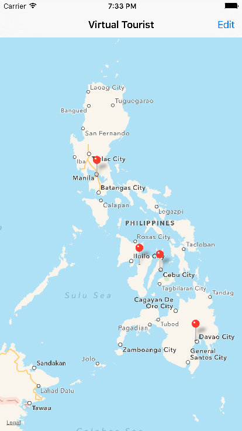
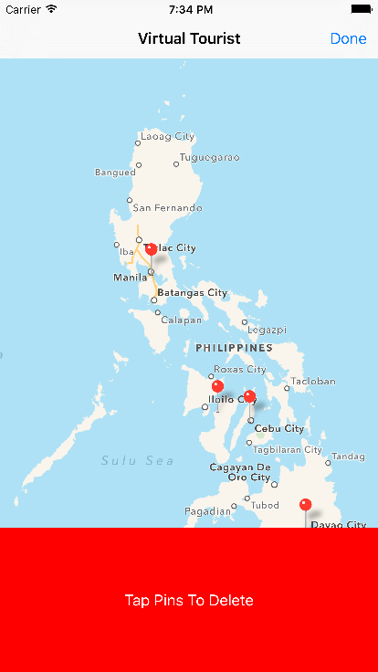
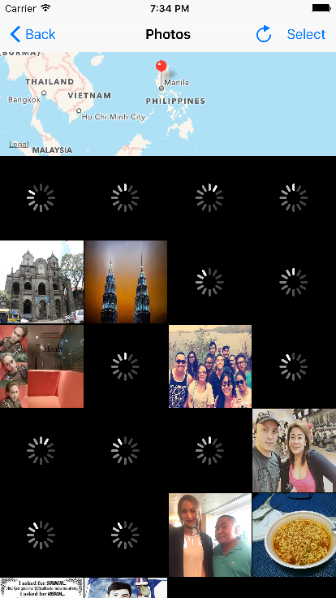
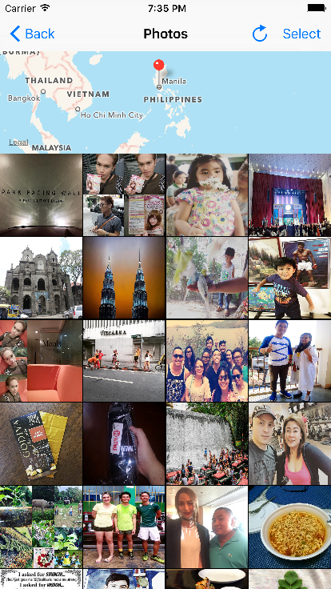
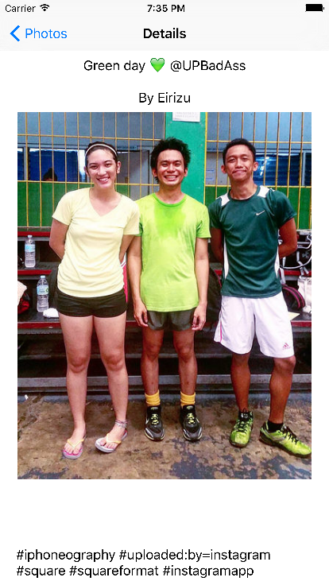

# Virtual Tourist

Udacity project: downloads and stores images from Flickr.

The app allows users to drop pins on a map, as if they were stops on a tour.

Users will then be able to download pictures for the location and persist both the pictures, and the association of the pictures with the pin. 

## Screenshots

## Author
Jovito Royeca, http://jovitoroyeca.com
